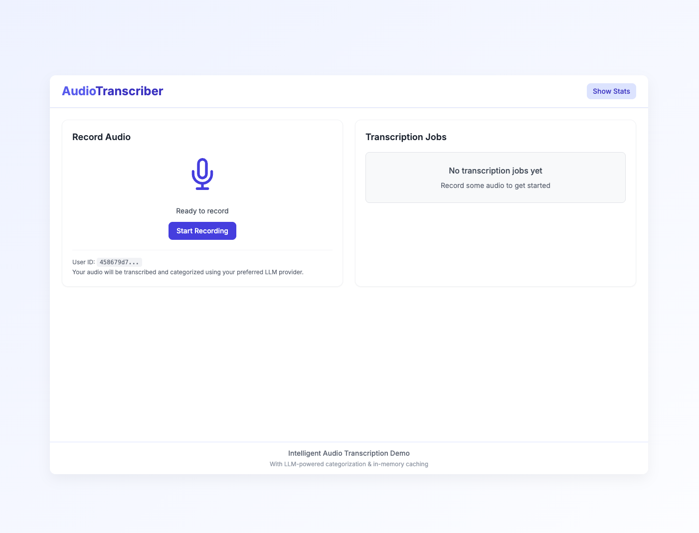

## Hi

### Review and basic adjustments
I started by converting flask to fastapi as I'm more comfortable with this and it's a better framework for building APIs (In my opinion of course!). 
I also added poetry for package management.
I added a config file using pydantic-settings to have all the confing in one file. The LLM API keys are also being loaded from env and stored there.

## Front-end
I didn't spend too much time on going through the front-end code. I simply used Claude to find the bugs and make required adjustments
I intentionally prompted it in a way to make the folder structure a little better and have services, more components and types. I also added tsconfig so my IDE wouldn't give me too much trouble with TS

## LLM Calls
I'm using basic langchain with pydantic and forcing the model to return a json object so it can be converted to pydantic. Then I return it to front-end.

## Caching
I'm using a very basic dict (hash table) to gather the hash values of transcript and use the pre-processed value in case we have it there.

## Version controlling between Front/Back
I'm using dependency injection to check the version. The logic is very simple, we're checking X-API-Version in the request header on the backend.
On the front-end, we define the version in APIService and on the backend, we define it in our settings.
Both backend and frontend show messages when version doesn't match

## Make it Pop
I'm using tailwind css with Google font and some colors to make it look nice. Also included some statistics about cashing.

## Logging
I added centralized logging to backend. 

## Next steps
There are plenty of things we can do depending on the direction of the product
- Repo:
  - pre-commit
  - styling
  - 

- Backend
  - Transcribe endpoint
  - Queue system to process jobs
  - Containerize the app for deployment
  - Add authentication mechanism like Oauth, JWT, ...
  - Real cashing of requests on something like redis
  - Database of user requests
  - ...

- Frontend
  - Analytic integration 
  - 

# App
App should looks like this when loaded.

